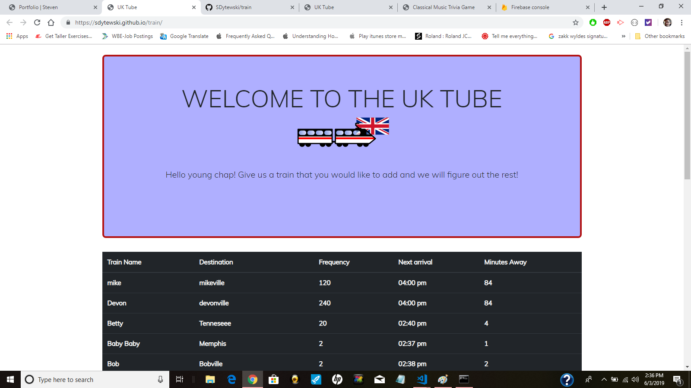
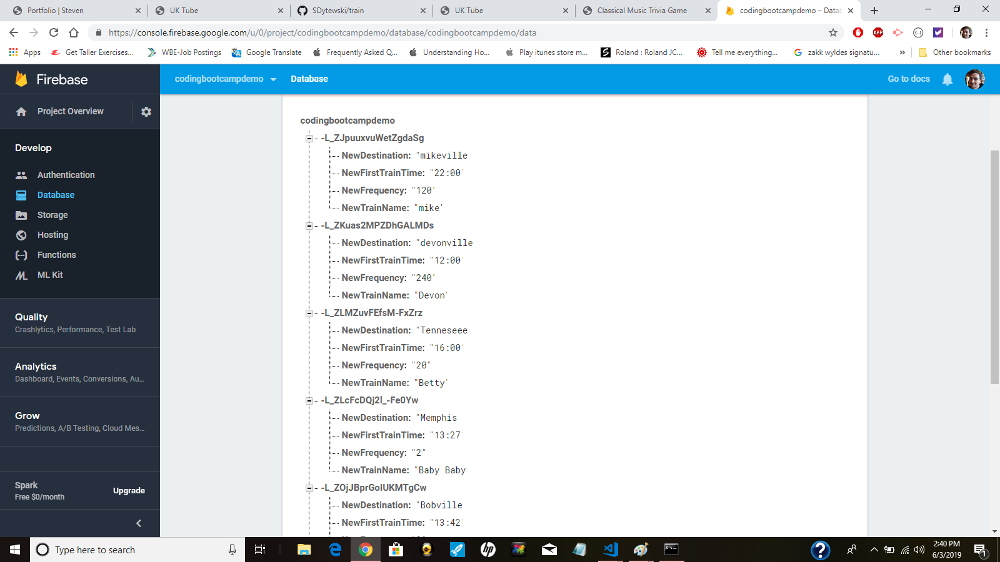
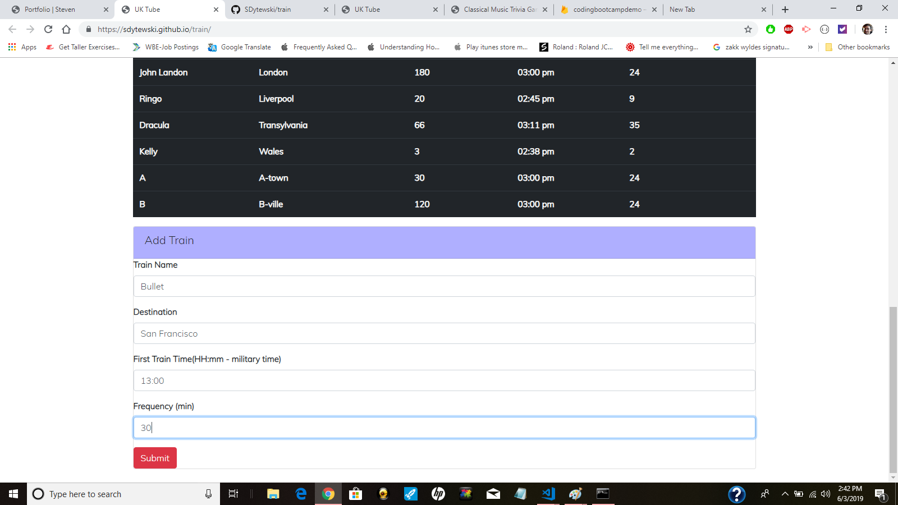
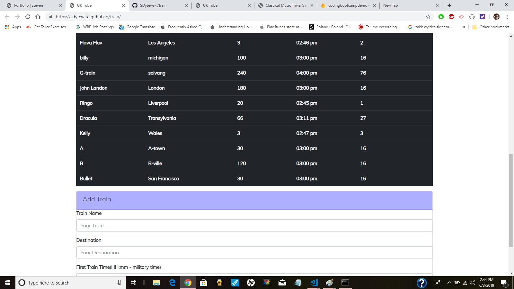
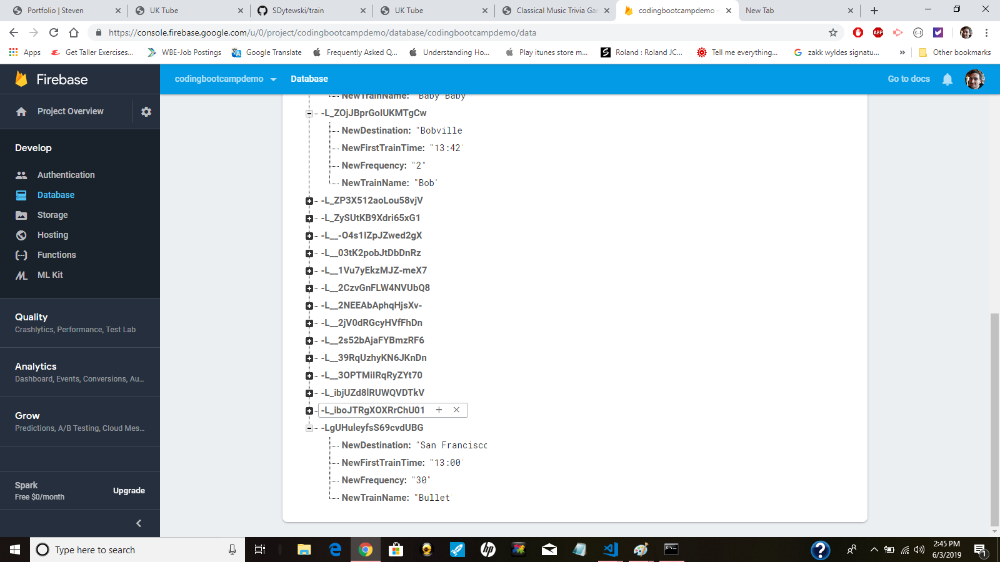

# The Train Scheduler

This application is for scheduling trains in a set amount of increments.  Trains can be added by the user.  Technologies used are HTML, CSS, Bootstrap 4, JavaScript, JQuery, and Firebase as a database.

**Example 1** There is only 1 page for this application. The landing page shows trains that have been added by previous users.  You can see "Train Name", "Destination", "Frequency" (in minutes), "Next Arrival", and   "Minutes Away."  I styled my project in a fun British theme.

**Example 2** Here is the "Back-End" information on Firebase. My database is called "codingbootcampdemo." You can see the columns and rows that are created for my trains. These are displayed on the Front-End. 

**Example 3** If a user scrols down on my page they will eventually come to "Add Train" where a user can add a train to the schedule.  I am adding a train called "Bullet" that goes to San Francisco starting at 1:00pm (13:00 military time) every 30 minutes. It is currently 2:42 on my computer clock in the right corner below. This means this train has come at 1:00pm, 1:30pm, 2:00pm, and 2:30pm

**Example 4** When the user hits "submit," their text will be added in a new row. Also, this is live information that will update when a user refreshes their browser. Current information like "Next Arrival" and "Minutes Away" will change. The user can see the "Bullet" train that has been added to the schedule. This train will come at 3:00. If you look at my computer clock on the lower right it says 2:44pm. This is why my train is 16 minutes away.

Calculations about when the train is coming were made using the moment.js function which uses current time to determine when the new train will come and how many minutes away the train is.

**Example 5** Here is my Firebase information. The "Bullet" train has been added exactly when the user hit "submit." It's listed on the bottom since it is the newest information.  

# Conclusion

This app demonstrated knowledge of using a database from Firebase and using the moment.js function for calculations.  Users can add information that will show up live every time a refresh is made on the page.

Deployed site is at https://sdytewski.github.io/train/